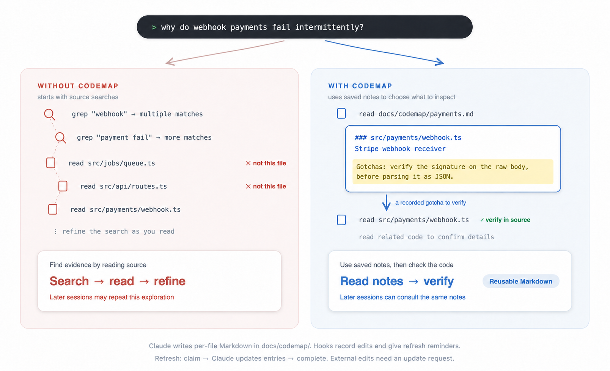

# claude-codemap

[](https://github.com/ayeeatelier/claude-codemap/actions/workflows/ci.yml)
[](LICENSE)

**English** · [한국어](README.ko.md) · [日本語](README.ja.md)

claude-codemap is a Claude Code plugin that saves notes about each source file: its role, key symbols, dependencies, and things to watch out for. Later sessions are instructed to consult these notes before searching the codebase.

Claude reads the source and writes one entry per file, grouped by module in `docs/codemap/`. An example entry:

```markdown
### src/payments/webhook.ts — Stripe webhook receiver
- Symbols: handleWebhook, verifySignature, replayGuard
- Depends on: stripe, PaymentStore, AuditLog
- Gotchas: Verify the signature against the raw request body,
  before parsing it as JSON.
```

The notes stay in your project as Markdown. No separate daemon or build step is needed.

## Usage

### 1. Prepare and install

Use the Claude Code terminal CLI with plugin support. The hooks require **bash, Git, and jq** on PATH. macOS and Linux are the verified platforms; Windows is untested.

If jq is missing, install it in your terminal: `brew install jq` on macOS, or `sudo apt-get install jq` on Debian/Ubuntu. Without jq, codemap guidance, edit tracking, and refresh reminders do not work. In projects with a codemap, the hooks report the missing dependency.

In Claude Code, register this repository as a plugin source:

```text
/plugin marketplace add ayeeatelier/claude-codemap
```

Then install codemap from that source:

```text
/plugin install codemap@claude-codemap
```

If prompted for a scope, choose **User** to use it across your projects, **Project** to share the setting with collaborators, or **Local** for yourself in this project only. See the [Claude Code installation guide](https://code.claude.com/docs/en/discover-plugins#install-plugins) for scope and activation details.

### 2. Create the project's codemap

After installation, start a new Claude Code session in the project you want to index and ask:

> Create a codemap for this project.

You can also invoke the skill directly with `/codemap:codemap-init`.

Claude lists the source files, reads them through parallel scanner agents, and writes the index. The skill instructs Claude to compare the indexed paths against the source list before reporting completion.

Open `docs/codemap/README.md` to check the module list and update rules. Each module's Markdown file contains the per-file entries. In subsequent sessions, the plugin adds instructions to consult this index. Projects without `docs/codemap/` are left alone.

<details>
<summary>Alternative: install from a local clone</summary>

Clone the repository in your terminal:

```sh
git clone https://github.com/ayeeatelier/claude-codemap.git
```

In Claude Code, register the cloned directory instead of the GitHub source above. Replace the example with its absolute path:

```text
/plugin marketplace add /absolute/path/to/claude-codemap
```

Then run `/plugin install codemap@claude-codemap` and follow step 2 above. Cloning or installing this plugin does not create an index of your project; that is a separate step.

</details>

## How it works and when to refresh

The plugin contains three hooks, the `codemap-init` skill, and a Haiku scanner agent. Hooks record paths and send instructions to Claude; Claude writes the summaries.

| When | What the plugin does |
| --- | --- |
| A session starts, resumes, or compacts | Adds instructions to read the index before broad code searches. |
| Claude edits a source file with Edit or Write | Records its path in `docs/codemap/.stale` for a later refresh. |
| Claude runs a command containing a recognized `git commit` through Bash | If entries are pending, asks Claude to refresh them before reporting the feature complete. This is a reminder after the command, not a Git commit blocker. |

**Tracking is limited to Claude's tools.** Changes from an external editor, shell scripts, `git pull`, or file deletions and moves are not automatically recorded. Commits in an ordinary terminal do not trigger the reminder. A failed or intermediate commit can also trigger it; Claude is told to ignore the reminder in those cases.

Before finishing work, or when entries are out of date, ask Claude:

> Refresh the pending codemap entries using the plugin's queue tool, then check them against the current source.

The session instructions tell Claude how to claim pending paths and mark them complete after updating the entries. Do not clear `.stale` or other queue files by hand: edits made during a refresh must remain pending. An interrupted refresh can be recovered through the same queue tool.

For changes made outside Claude, name the changed paths, including deleted or moved files, and ask it to update their entries and the module list. If you do not know the affected paths, ask it to rebuild the project's codemap.

<details>
<summary>Illustration: source searches and codemap-guided exploration</summary>



The left side finds relevant files through source searches. The right side uses saved notes about each file's role, symbols, dependencies, and gotchas to narrow down what to inspect. Both paths still require checking the source. This is an example of the exploration workflow, not a measured performance comparison.

Claude writes the notes as Markdown in `docs/codemap/`. Hooks record paths changed with Edit or Write and give refresh reminders. To refresh, Claude claims the pending paths, updates their entries, and completes that batch. The hooks do not rewrite summaries themselves. Changes made outside Claude need an explicit update request.

</details>

## Cost and benefit

Building the index requires reading the selected source files and generating summaries. Ongoing usage includes the session guidance, reading relevant entries, and rewriting entries after changes. All of these consume tokens; the total depends on your project and workflow.

A small development experiment with two questions and three with/without comparisons reported 25–39% fewer tokens with the index. The repository does not include enough data to reproduce those runs or calculate monetary savings or a break-even point. See the [measurement notes](docs/measurement-notes.md) for the recorded figures and their limits.

## Good to know

- Summaries can be wrong or incomplete. They help locate and understand code; check the source before relying on a claim. When the index and source disagree, update the index.
- LSP is optional and installed separately. When available, the guidance prefers it for precise definitions, references, and call hierarchies. See [LSP companion setup](docs/lsp-setup.md). codemap itself does not build a call graph.
- Common source extensions are built in. Add other extensions to `docs/codemap/.extensions`, one per line without a dot. Vendored directories, build output, and the codemap directory itself are excluded from tracking.
- For small repositories, maintaining the notes may cost more than repeating a search. The init skill is instructed to warn before indexing very small projects and suggest staged generation for large ones; these are heuristics, not measured cutoffs.

## Contributing

Bug reports and pull requests are welcome. Please open an issue before a large change. The implementation uses Bash and awk; the scanner and skill instructions are Markdown.

Run the checks from the repository root before submitting a PR:

```sh
bash tests/run.sh
```

```sh
shellcheck scripts/*.sh tests/*.sh
```

CI runs both checks. Changes to the public documentation should stay consistent across the three READMEs and the language sections in `docs/index.html`.

To inspect the real Claude Code scenario without making model calls, run:

```sh
bash tests/live-claude-code.sh --dry-run
```

After Claude Code is authenticated, run the live validation:

```sh
bash tests/live-claude-code.sh --live
```

The live run loads this checkout with `--plugin-dir`, creates a disposable two-file project, and checks codemap generation, edit tracking, queue refresh, and the commit reminder. It consumes model tokens. Failed runs preserve the fixture and JSONL logs; pass `--keep` to preserve a successful run too.

## License

[MIT](LICENSE)
